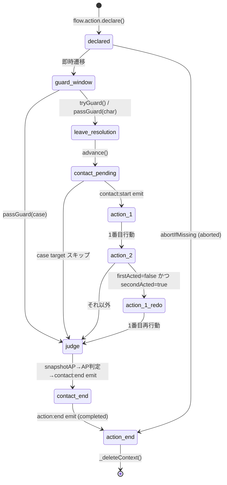

# 🤖 Action FSM (10 phases)

> ⚠️ このファイルは `scripts/gen-docs/gen-flows.ts` により自動生成された。手で編集しない。
> 再生成: `npm run docs:flows`
> Source hash: `588a74718766`

`flow.action.declare → advance` の 10 フェーズ状態機械（abort 経路含む）。 `flow.action.tryGuard` / `passGuard` で初期分岐し、 `snapshotAP` で AP スナップショットを取って `judge` 段階で勝敗を確定する。

## 状態遷移図

## 補足

> ✅ ActionPhase は想定 10 フェーズと完全一致

各フェーズで emit される Hook:

- `declared` → `action:declare`
- `guard-window` → `action:guard-window`
- `leave-resolution` → 直接 emit なし（【現場リムーブ時】解決窓）
- `contact-pending` → `contact:start`, `contact:order-set`
- `action-1` / `action-2` / `action-1-redo` → 各プレイヤーの cutIn / disguise / pass
- `judge` → `contact:before-judge`
- `contact-end` → `contact:end`
- `action-end` → `action:end` (`result: completed` or `aborted`)

---

## ソース

- [`src/engine/types/results.ts`](../../../src/engine/types/results.ts)
- [`src/engine/flow/action/state-machine.ts`](../../../src/engine/flow/action/state-machine.ts)
