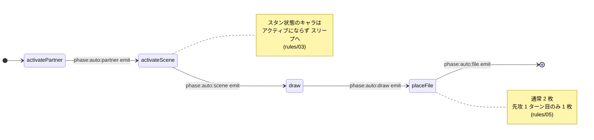

# 🤖 オートフェイズ (4-step)

> ⚠️ このファイルは `scripts/gen-docs/gen-flows.ts` により自動生成された。手で編集しない。
> 再生成: `npm run docs:flows`
> Source hash: `f36b0e195708`

`flow.runAutoPhase()` が 1 ターンの開始時に走らせる 4 ステップ。各ステップは Hook を emit するのみで、 能力発火 (登場時等) は pendingEffects に積まれ、呼出元が `engine.resolve.runAllUntilEmpty` で解決する。

## 状態遷移図

## 補足

- ⚠ スキップ条件: できる状況でなければスキップ (rules/05)。例: 1 ターン目はパートナー active 済みなのでスキップ。
- 先攻 1 ターン目のみ FILE 配置は **1 枚**（`turn.isFirstPlayerFirstTurn`）。

---

## ソース

- [`src/engine/flow/auto-phase.ts`](../../../src/engine/flow/auto-phase.ts)
- [`src/engine/flow/turn.ts`](../../../src/engine/flow/turn.ts)
