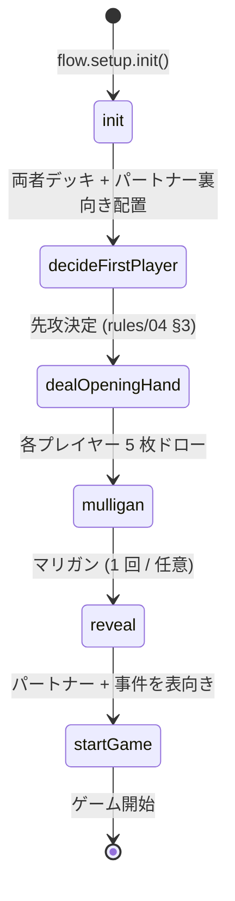

# 🤖 ゲーム開始フロー (6-step)

> ⚠️ このファイルは `scripts/gen-docs/gen-flows.ts` により自動生成された。手で編集しない。
> 再生成: `npm run docs:flows`
> Source hash: `0a6d08107473`

`flow.setup` の 6 ステップ。各ステップは GameState を Immer draft で変更し、 最終的に `gameStart` 状態（turn.number=1, phase=auto, isFirstPlayerFirstTurn=true）へ到達する。

## 状態遷移図

## 補足

- マリガン: **先攻が先**に決定（rules/04 §5）。FILE は 0 枚スタート。
- 必要証拠数: 先攻=7, 後攻=6（`PlayerState.case.requiredEvidence`）。
- 先攻 1 ターン目のオートフェイズで FILE=1 配置（auto-phase.md 参照）。

---

## ソース

- [`src/engine/flow/setup.ts`](../../../src/engine/flow/setup.ts)
