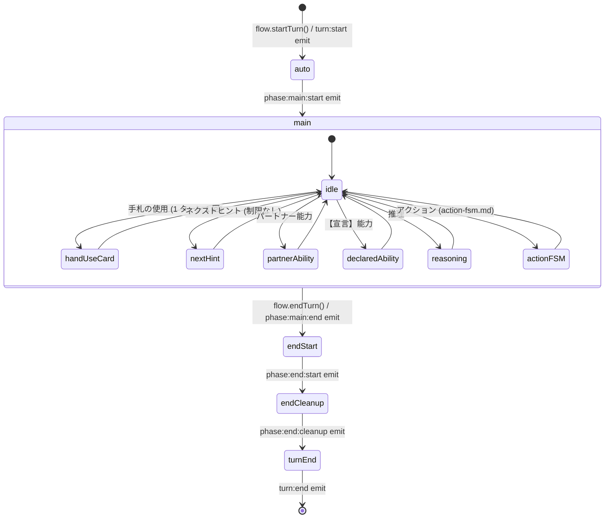

# 🤖 ターンライフサイクル (auto → main → end)

> ⚠️ このファイルは `scripts/gen-docs/gen-flows.ts` により自動生成された。手で編集しない。
> 再生成: `npm run docs:flows`
> Source hash: `8a24282fce0c`

1 ターンは 3 フェイズ（auto / main / end）で構成され、6 種類のメイン行動が好きな順番で実行される。 詳細は `rules/05-turn-phases.md` を参照。

## 状態遷移図

## 補足

- イベント発火順 (1 ターン): `turn:start` → `phase:auto:start` → `phase:auto:before-draw` → `phase:auto:after-draw` → `phase:auto:after-file` → `phase:main:start` → ...(main 行動) → `phase:main:end` → `phase:end:start` → `phase:end:cleanup` → `turn:end`
- 手札の使用は **1 ターン 1 回まで** （`turnState[p].handUseUsed`）。ネクストヒントを行ったターンは手札使用不可。

---

## ソース

- [`src/engine/flow/turn.ts`](../../../src/engine/flow/turn.ts)
- [`src/engine/flow/main/index.ts`](../../../src/engine/flow/main/index.ts)
