# 🤖 関係グラフ (engine-core) ↔ rules

> ⚠️ このファイルは `scripts/gen-docs/gen-mapping.ts` により自動生成された。手で編集しない。
> 再生成: `npm run docs:mapping`
> Source hash: `6fc110567900`

engine namespace types / read / mutate / event / cards と公式ルールの参照関係を Mermaid flowchart で表示。Obsidian グラフビュー連携は [by-rule/](./by-rule/) / [by-engine/](./by-engine/) を参照。

```mermaid
flowchart LR
  subgraph engine["Engine Namespaces"]
    NS_cards["cards"]
    NS_event["event"]
    NS_mutate["mutate"]
    NS_read["read"]
    NS_types["types"]
  end
  subgraph rules["Rules"]
    R_01_victory_conditions_md["01-victory-conditions"]
    R_02_deck_construction_md["02-deck-construction"]
    R_03_field_areas_md["03-field-areas"]
    R_04_game_setup_md["04-game-setup"]
    R_05_turn_phases_md["05-turn-phases"]
    R_06_card_types_md["06-card-types"]
    R_07_action_flow_md["07-action-flow"]
    R_08_contact_md["08-contact"]
    R_09_cutin_disguise_md["09-cutin-disguise"]
    R_10_action_event_md["10-action-event"]
    R_11_reasoning_md["11-reasoning"]
    R_12_next_hint_md["12-next-hint"]
    R_13_keywords_md["13-keywords"]
    R_14_refresh_md["14-refresh"]
    R_15_abilities_effects_md["15-abilities-effects"]
    R_16_card_set_md["16-card-set"]
    R_17_icons_md["17-icons"]
    R_18_mr_md["18-mr"]
    R_19_special_rules_md["19-special-rules"]
    R_20_color_and_switch_md["20-color-and-switch"]
    R_21_declared_ability_cost_md["21-declared-ability-cost"]
    R_22_qa_action_contact_md["22-qa-action-contact"]
    R_25_qa_effects_resolution_md["25-qa-effects-resolution"]
    R_26_07_02_md["26-07-02"]
    R_26_qa_deck_refresh_md["26-qa-deck-refresh"]
  end
  NS_cards --> R_02_deck_construction_md
  NS_cards --> R_06_card_types_md
  NS_cards --> R_19_special_rules_md
  NS_cards --> R_20_color_and_switch_md
  NS_event --> R_15_abilities_effects_md
  NS_mutate --> R_01_victory_conditions_md
  NS_mutate --> R_03_field_areas_md
  NS_mutate --> R_04_game_setup_md
  NS_mutate --> R_05_turn_phases_md
  NS_mutate --> R_06_card_types_md
  NS_mutate --> R_09_cutin_disguise_md
  NS_mutate --> R_10_action_event_md
  NS_mutate --> R_11_reasoning_md
  NS_mutate --> R_12_next_hint_md
  NS_mutate --> R_13_keywords_md
  NS_mutate --> R_14_refresh_md
  NS_mutate --> R_16_card_set_md
  NS_mutate --> R_18_mr_md
  NS_mutate --> R_19_special_rules_md
  NS_mutate --> R_20_color_and_switch_md
  NS_mutate --> R_26_qa_deck_refresh_md
  NS_read --> R_01_victory_conditions_md
  NS_read --> R_02_deck_construction_md
  NS_read --> R_03_field_areas_md
  NS_read --> R_04_game_setup_md
  NS_read --> R_05_turn_phases_md
  NS_read --> R_06_card_types_md
  NS_read --> R_09_cutin_disguise_md
  NS_read --> R_10_action_event_md
  NS_read --> R_11_reasoning_md
  NS_read --> R_12_next_hint_md
  NS_read --> R_13_keywords_md
  NS_read --> R_14_refresh_md
  NS_read --> R_17_icons_md
  NS_read --> R_19_special_rules_md
  NS_read --> R_26_07_02_md
  NS_types --> R_01_victory_conditions_md
  NS_types --> R_02_deck_construction_md
  NS_types --> R_03_field_areas_md
  NS_types --> R_05_turn_phases_md
  NS_types --> R_06_card_types_md
  NS_types --> R_07_action_flow_md
  NS_types --> R_08_contact_md
  NS_types --> R_09_cutin_disguise_md
  NS_types --> R_11_reasoning_md
  NS_types --> R_13_keywords_md
  NS_types --> R_14_refresh_md
  NS_types --> R_15_abilities_effects_md
  NS_types --> R_19_special_rules_md
  NS_types --> R_21_declared_ability_cost_md
  NS_types --> R_22_qa_action_contact_md
  NS_types --> R_25_qa_effects_resolution_md
```

