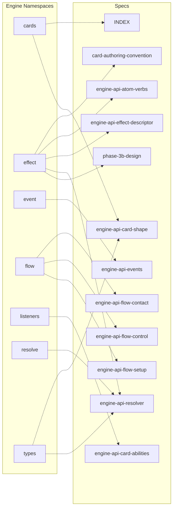

# 🤖 関係グラフ: engine ↔ specs

> ⚠️ このファイルは `scripts/gen-docs/gen-mapping.ts` により自動生成された。手で編集しない。
> 再生成: `npm run docs:mapping`
> Source hash: `02d42ce2f7a4`

engine namespace と仕様書の参照関係を Mermaid flowchart で表示。`cards-analysis/` 配下は 1:1 で量が多いため除外。Obsidian グラフビュー連携は [by-spec/](./by-spec/) / [by-engine/](./by-engine/) を参照。

