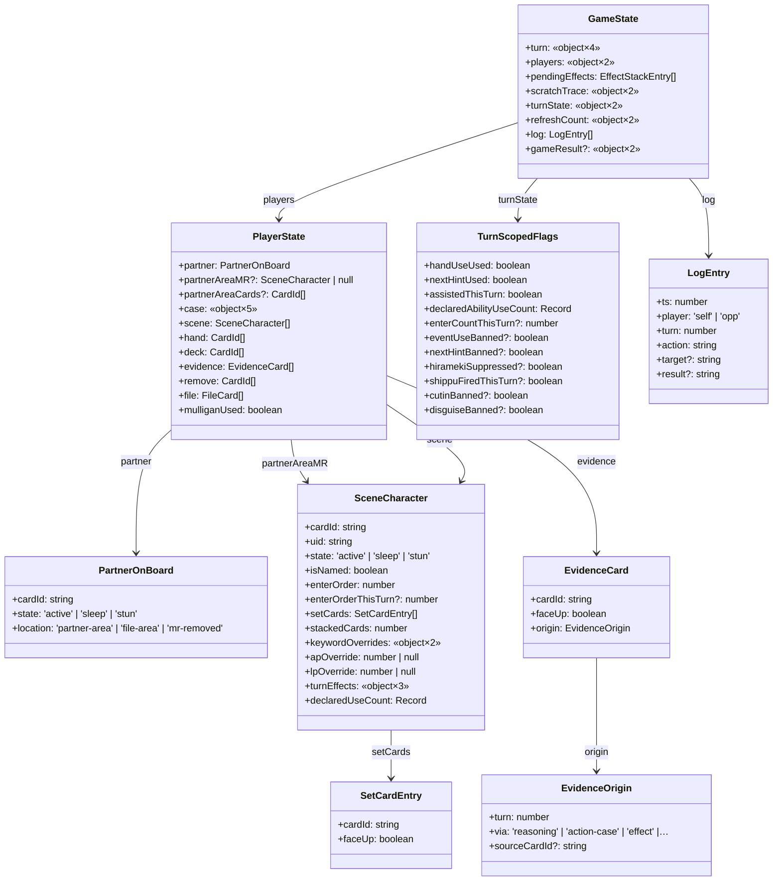

# 🤖 GameState shape

> ⚠️ このファイルは `scripts/gen-docs/gen-state.ts` により自動生成された。手で編集しない。
> 再生成: `npm run docs:state`
> Source hash: `374be65b5268`

`src/engine/types/game-state.ts` から抽出した GameState の構造図。

9 型・9 関係を抽出。`«object×N»` は匿名 object 型（N フィールド）の省略表記。

## Mermaid classDiagram

---

## ソース

- [`src/engine/types/game-state.ts`](../../../src/engine/types/game-state.ts)
